<!-- 3D ascii wordmark: extruded "YAHYA" that wipes in, then rocks on its
     vertical axis. regenerate with: python scripts/make_wordmark_svg.py -->

<h3>Who am I</h3>

 

 

<!-- animated contribution graph: real data, boxes pop in cell by cell
     (regenerated daily by .github/workflows/update-profile-art.yml) -->

<h3>Contributions</h3>

  

<h3>Links</h3>

 

 

